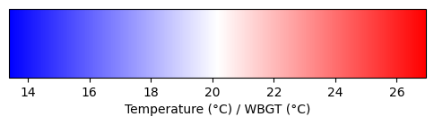

# Ugent Heat Stress Measurement campaign @ Antwerp 10 Miles 2026

We are conducting a heat stress measurement campaign with practical assistance from [GOLAZO](https://www.golazo.com/).
We have multiple sensors measuring the heat stress along the course of the Antwerp 10 Miles, including:
- Fixed stations
- Hikers with a meteo-backpack
- Runners with a meteo-running vest
- Internal body temperature sensors (ingestible pill)

INSERT IMAGE OF THE FOUR TYPES OF SENSORS

# Heat Stress

[Heat stress](https://climate.copernicus.eu/heat-stress-what-it-and-how-it-measured) occurs when our body cannot cool itself effectively.
It is impacted by a combination of several factors such as:
- Clothing
- Activity intensity (metabolic rate)
- Meteorological conditions (the weather)

For the weather, not only the air temperature is important, but also the humidity, the wind speed and the solar radiation have a big impact on the heat stress.

This measurement campaign will allow us to better understand how the meteorological conditions along the course impact the internal body temperature of the runners.

# Results

The results will be shared once the data has been analyzed.
In a previous campaign, we measured during the [Dodentocht](https://www.dodentocht.be/), which gives us results such as the following:

<h3 style="display: flex; justify-content: space-between;">
  Temperature (°C)
  WBGT (°C)
</h3>
<iframe src="data/test.html" height="500" width="500"></iframe>

Observed temperature (left) and [WBGT](https://en.wikipedia.org/wiki/Wet-bulb_globe_temperature) (right)  during the Dodentocht 2024. 

# Contact

For emergencies during the event, please contact:
- XXX: +yyy-yyy-yyy

For any questions regarding the campaign or interest in the results, please contact us via e-mail:
- XXX
- XXX
- XXX